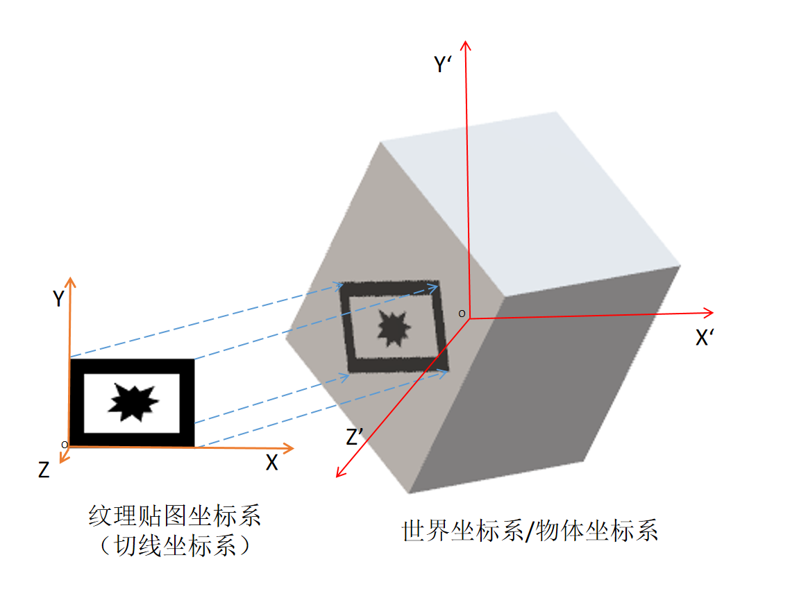
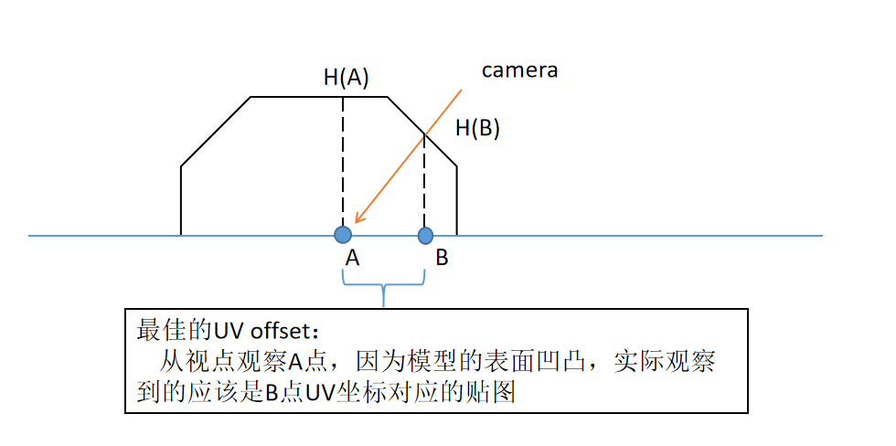
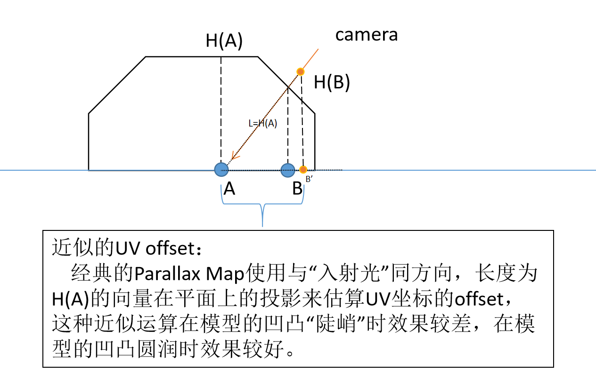
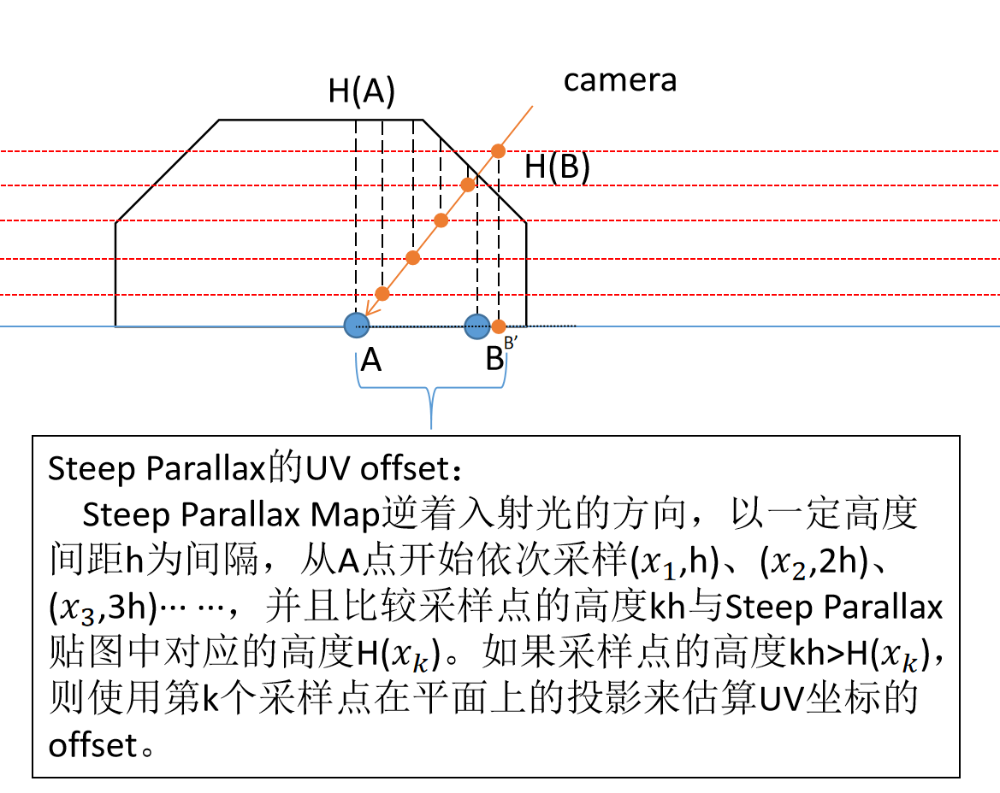

# Game Environment Dev

- [Game Environment Dev](#game-environment-dev)
  - [前言](#前言)
    - [游戏环境开发的工作](#游戏环境开发的工作)
      - [游戏环境开发的技术指标](#游戏环境开发的技术指标)
  - [第一部分：基础](#第一部分基础)
    - [基础名词](#基础名词)
      - [一、贴图、纹理与材质](#一贴图纹理与材质)
        - [各种纹理贴图类型](#各种纹理贴图类型)
          - [1.颜色贴图](#1颜色贴图)
        - [2.凹凸贴图](#2凹凸贴图)
      - [二、物理学术语](#二物理学术语)
        - [Albedo（反照率）](#albedo反照率)
      - [三、光照模型](#三光照模型)
        - [lambert模型](#lambert模型)
        - [phong模型](#phong模型)
        - [pbr模型](#pbr模型)
    - [第一章：游戏世界优化](#第一章游戏世界优化)
      - [MIP mapping](#mip-mapping)
      - [Texture pages(T-pages/atlas textures/texture packing)](#texture-pagest-pagesatlas-texturestexture-packing)
      - [Unlit textures](#unlit-textures)
      - [multi-texturing(multiple UV channels)](#multi-texturingmultiple-uv-channels)
      - [light map](#light-map)

## 前言

### 游戏环境开发的工作

- 作为一个游戏环境开发人员，需要从六种角度来理解并掌握游戏项目的开发
  - 游戏的主题（Theme）
    - 游戏的主题要求游戏环境开发人员能够正确地把握游戏想要给玩家传递的情绪、精神特点，从而合理地安排美术、声效资源，并且使得不同开发人员之间做到视觉风格的基本统一
  - 游戏的视角（Perspective）
    - 玩家在游玩游戏时的视角会极大地影响开发人员的侧重点，从而降低游戏美术资源的开发成本
  - 游戏的套路（Genre）
    - 游戏的套路同样影响着开发人员对美术资源的使用方式，因为不同的游戏套路往往对应着不同的游戏场景
  - 游戏世界的大小（World Size）
  - 游戏中涉及的技术（Technology）
  - 游戏项目的资金、时限等制约因素（Limitations）

#### 游戏环境开发的技术指标

- 作为一个游戏环境开发人员，需要从以下几个角度对游戏项目涉及到的技术进行审视：
  - 技术预算（technical budgets）：帧率（frame rate）、纹理内存容量（texture memory）、多面形数（polygon counts）··· ···
  - 技术数据（technical stats）：文件格式（file formats）、分辨率（resolutions）··· ···
  - 命名存储规范（naming and storage convention）
  - 碰撞逻辑（how collision will be handled）
  - 距离与大小（what the sizes of the things in the world, and the distances）

## 第一部分：基础

### 基础名词

#### 一、贴图、纹理与材质

- （模型）网格
  - Mesh，计算机通过存储多边形（一般是三角形），对3D物体的形状进行建模
  - （模型）网格构成了3D模型的骨架，而纹理则补全了3D模型的外观
  - 渲染器（shader）则为模型添加了动态视觉效果

- 高模、低模
  - mesh网格的相对密度决定了一个模型是高模还是低模。
  - 利用高模烘焙的法线贴图回帖到低模上，让低模在游戏引擎里可以及时显示高模的视觉效果。所谓的次世代游戏一般都选择这种建模方法。

- （纹理）贴图：
  - Texture Map，实际上是一种映射，3D模型表面的许多细节（纹理），包括色彩、花纹、光照、粗糙效果等，都可以通过将**2D图片**通过映射到3D模型表面的方法（UV映射等），予以实现。这种映射方法所用到的2D图片即为（纹理）贴图。
  - 为了降低模型网格的复杂性，小幅度且重复出现的凹陷、突起效果也可以使用（纹理）贴图的方法来实现
  - 纹理贴图技术包括：
    - UV mapping
    - Diffuse Map
    - Specular Map
    - Normal Map
    - Displacement Map
    - Ambient Map
    - Gloss Map

- 纹理：
  - Texture，一般把3D模型表面的全部视觉细节称为纹理。3D模型仅仅决定物体的空间属性，纹理则决定该物体的几乎全部视觉属性。
  - 定义纹理的方法大致分为两种，一种是贴图（通过UV映射，将图片上的纹理细节映射到3D模型的表面）；另一种是程序纹理（Procedural Texture），shader（或者其它计算机程序）根据3D模型表面某个点的实时数据（坐标、光照等），生成程序纹理。

- 材质：
  - Material，实质上是一个可供shader读取的数据集，在内容上包括了纹理、光照算法等等“数据”。

##### 各种纹理贴图类型

###### 1.颜色贴图

- 颜色贴图主要为Diffuse、Albedo、Base Color三种。一般认为这三者是等同的。 

- diffuse map：
  - 光照模型在Lambertian（兰伯特材质球）着色器中会把颜色贴图叫做Diffuse Map（也叫颜色贴图），通常在绘制这张Diffuse Map的时候会把物体的结构阴影信息也绘制进去。因为在传统工作流中，Diffuse Map是带着光影信息的。
  - pbr工作流程中的diffuse map一般不具有传统diffuse map中的那些琐碎的光影信息。

- albedo map：
  - albedo map与pbr工作流程中的diffuse map是几乎一致的，仅保存基本的（漫）反射信息（也就是颜色信息），而没有光影信息。

- base color map：
  - base color是把diffuse map剔除光影变化后，我们看到的最基础的颜色。在pbr工作流中用到的颜色贴图叫做base color map， 其中包含了电介质的（漫）反射颜色和金属的反射率值这两种类型的数据。因为base color map中带了金属的反射率值，所以需要配合上metallic map一起使用的。

##### 2.凹凸贴图

- 凹凸贴图主要分为Bump、Normal和Displacement三种。
  - 其中Displacement有时用于改变模型的顶点位置，而Bump和Normal则不会改变模型的顶点位置。
  - 就实现复杂度/质量与性能开销而言，Dispalcement>Normal>Bump(>Reflection)。

- Bump贴图
  - Bump Map（凹凸贴图 ）是一个类似于法线贴图的概念，有时也称为Height（高度图）。但是凹凸贴图只包含高度信息而不包含角度信息。
  - 凹凸贴图的优点是可以很直观地看出模型表面的凹凸情况（颜色越浅表明该位置的表面越像外凸起，反之亦然），但是计算更复杂，因此更性能开销更大。高度图通常与法线贴图结合使用，用于给出表面凹凸的额外信息。

- Normal贴图
  - Normal Map（法线贴图）是凹凸映射技术的另一种应用。法线贴图包含角度信息而不包含任何高度信息，其R、G、B三个通道储存的信息表示了斜面的方向和陡峭程度。使用法线贴图和高度贴图可以确保光照和位移（displacement）是一致的，能够带来更真实的效果。
  - 这一特征使得shader可以使用法线贴图储存的角度信息来柔化尖锐的边缘（仅使用Bump高度信息无法做到这一点，因为只有高度信息无法知道边缘应该沿着哪个方向弯曲）。柔化边缘不仅可以让物体看起来更真实，还能进一步突出物体的形状（尤其是在游戏对象在屏幕上占比较小的时候）。
  - 由于法线贴图存储的是表面的法线方向，而方向是相对于坐标空间而言的。因此存在三种不同的空间法线贴图：
    - Tangent切线空间，也就是法线贴图中的坐标是相对于纹理贴图本身而定义的，与3D物体的刚体变换无关。
    - Object对象空间
    - World世界空间
  - 三种法线贴图都有各自的优缺点且能达到相同的效果，只是计算方式有所不同。一般来说，使用切线空间来定义法线贴图。
    - 每当3D物体发生刚体变换时（旋转/位移），用世界空间坐标系表示的法线贴图都会发生改变。因此shader一般使用切线空间坐标系的法线贴图结合顶点法向量来进行渲染。
  

- Displacement贴图
  - Displacement Map（置换贴图，也叫移位贴图）可以改变模型对象的几何形状，但要达到较好的置换效果需要提高模型本身的顶点数，通常结合曲面细分使用。因此在提供最真实的效果的同时也会大幅增加渲染性能的开销。
  - 传统的置换贴图只存储高度数据，从而让模型的顶点沿着某个固定方向变化移动。一般来说，传统的游戏地形（terrain）都是由这种贴图构造的。
    
- Vector Displacement贴图：
  - Vector Displacement Map（矢量置换贴图）是高度贴图的扩展，UE5的Nanite中就使用了这一技术。
  - 与传统的Displacement贴图不同，Vector Displacement贴图能够将顶点（vertices）进行多个方向的偏移（offset），而不是仅在网格法向量（mesh face normal）方向上进行偏移（也就是在高度上进行偏移）。
  - Vector Displacement Map 凭借其强大的精细化修改模型的能力，能够以一种3D粘贴（stamp）的形式，对一些低模进行精细装饰（比如把不同的耳朵、胡须外形等制成不同的VDM，然后通过应用这些贴图，快速生成精细的人脸模型），从而极大地提高资产生成（asset production）的效率。

- Parallax贴图
    - Parallax Map（视差贴图）使用视差偏移来给模型的顶点添加上高度或深度信息，从而使得shader在对贴图进行采样的时候，能够根据Parallax贴图中储存的高度信息和摄像机此时的视点方向，对采样的 UV 坐标进行一定的偏移，来达到模拟凹凸的效果。
      - Parallax Map原理  
      - Parallax Map实现  

    - Steep Parallax贴图
      -   

    - Parallax Occlusion贴图
      - 对Steep Parallax贴图进行优化，与经典的陡峭视差贴图方法不同，Parallax Occlusion贴图不直接选择第一个高度大于Parallax贴图中高度的采样点，而是通过线性插值，在这个采样点和前一个采样点之间插入一个采样点Occ，并且使用Occ在平面上的投影估算UV坐标的offset。

#### 二、物理学术语

##### Albedo（反照率）

- 反照率（albedo）是行星物理学中用来表示天体反射本领的物理量，定义为物体的辐射度（radiosity）与辐照度（irradiance）之比。
- 绝对黑体（black body）的反照率是0。煤炭呈黑色，反照率 接近0，因为它吸收了投射到其表面上的几乎所有可见光。镜面将可见光几乎全部反射出去，其反照率接近1。
- albedo 翻译成反照率，与 reflectance（反射率）是有区别的。
  - 反射率用来表示单一一种波长的反射能量与入射能量之比。
  - 而反照率用来表示全波段的反射能量与入射能量之比。BRDF 里的 R 是 reflectance，方程仅关注一种波长。

#### 三、光照模型

##### lambert模型

##### phong模型

##### pbr模型

- 在PBR没有出现之前，我们最经常看到的光照模型 — Lambert。Shader中经常定义了一张纹理叫做Diffuse Map。

- 在传统工作流程中，通常在绘制这张Diffuse Map的时候会把阴影信息也绘制进去。就像是我们正常拍摄的一张照片，可以看得到阴影一样。

- 在PBR指南中，PBR工作流程分成了两个派系：
  - Metal/Roughness
  - Specular/Glossiness
- 这两个派系在纹理运用上的共同点是：
  - 使用相同的AO、Normal、Height纹理。这三张纹理在PBR指南中叫做Common Maps(通用纹理)。
- 不同点是：

  - Metal/Roughness工作流程使用：Base Color、Roughness、Metallic三种纹理来作为基础纹理。

  - Specular/Glossiness工作流程使用：Diffuse、Glossiness、Specular三种纹理来作为基础模型。

- Metal/Roughness：
  - 在Base Color Map中包含了2种类型的数据：
    - 电介质(dielectrics)的（漫）反射颜色和金属的反射率(reflectance)值。
    - 与传统的Diffuse Map相比Base Color Map的色调更平缓，对比度更低。并且，因为Base Color Map中带了金属的反射率值，所以这部分它是要配合上Metallic Map一起使用的。

- Specular/Glossiness
  - Diffuse Map中，物体的非金属区域使用漫反射颜色来填充，在金属区域使用黑色来填充。
    - 光在金属材质的上一部分被反射一部分被折射吸收(不会在内部传递后再次射出表面)，因此对于金属材质而言它没有漫反射(或者说比较少)，所以这里使用黑色区域来填充。
    - 而非金属材质反射光少于金属材质，并且它折射的光只有较少的吸收通常重新折射回表面，因此对于非金属材质，使用的是漫反射颜色来填充。

### 第一章：游戏世界优化

- 游戏环境优化的三种介入点：
  - 素材资产（asset）
  - 碰撞（collision）
  - 遮挡（occlusion）

- 游戏环境优化的常见方法：
  - asset-based optimization
  - MIP mapping(texture level of detail)
  - Texture pages
  - Unlit textures
  - Multiple UV chanels
  - Lightmaps
  - Masking and transparency
  - Texture size and compression
  - Particle system
  - forced perspective
  - polygon optimization
  - LoD (Level of Detail)
  - Collision-based optimization
  - Collision objects
  - Collision types
  - Occlusion-based optimizations
  - Occlusion and culling
  - View frustum
  - Distance fog
  - Cull distance
  - Cells and portals

#### MIP mapping

- Mipmap中每一个层级的小图都是主图的一个特定比例的缩小细节的复制品。当贴图被缩小或者只需要从远距离观看时，mipmap就会转换到适当的层级。事实上，在三线性过滤（trilinear filtering）起作用时，会在两个相近的层级之间切换。

- 因为mipmap贴图需要被读取的像素远少于普通贴图，所以渲染的速度得到了提升。而且操作的时间减少了，因为mipmap的图片已经是做过抗锯齿处理的，从而减少了实时渲染的负担。放大和缩小也因为mipmap而变得更有效率。

- 如果贴图的基本尺寸是256x256像素的话,它mipmap就会有8个层级。每个层级是上一层级的四分之一的大小，依次层级大小就是：128x128;64x64;32x32;16x16;8x8;4x4;2x2;1x1(一个像素)。例如在一个场景中，渲染贴图需要填满的空间大小是40x40像素的话，如果没有三线性过滤，那32x32 会被放大显示，或者有三线性过滤，会在64x64和32x32之间切换。最简单的生成贴图的方法就是依次做平均，当然也可以用更加高级的算法。

#### Texture pages(T-pages/atlas textures/texture packing)

- 在计算机图形学中，TextureAtlas纹理图集（也称为精灵表或图像精灵），它包含了多个较小贴图的图像，通常它们打包在一起以减少整体尺寸。TextureAtlas可以由大小一致的贴图或不同尺寸的图像组成。它通过使用自定义纹理坐标绘制子纹理以便将它们从TextureAtlas中选取出来。

- 使用TextureAtlas是游戏中优化的一种手段，它能够有效减少GPU纹理内存的开销，并在某些方面提供了更多的灵活性，比如多个共用部分纹理的3D模型，在纹理打包成为TextureAtlas后就可以去掉重复的部分。

- 一般来说，TextureAtlas可以优化游戏的性能，但是如果游戏中的某个场景涉及到存储在不同TextureAtlas中的纹理，则这些TextureAtlas的频繁切换会挤占显存空间。

#### Unlit textures

- 现在游戏常用材质分为PBR(Standard)和不受光材质(Unlit)。
- 次世代游戏用的是PBR材质,其中最基本的是4张纹理贴图：
  - 颜色贴图
  - Normal贴图
  - AO贴图
  - 高光贴图
- 不受光材质：
  - 像魔兽世界把特效关闭，一个模型的只靠最基本的颜色贴图，游戏中的灯光用的也是图片模拟的光晕，材质根本不受光。
- 由于不受光材质比PBR的性能高出太多，PBR的浮点计算量大概是PBR4个贴图都用上的10几倍。

#### multi-texturing(multiple UV channels)

- 这个特殊术语（multi-texturing）与显卡和实时图形 API 的演变有关。实际上，图像处理和离线图形渲染早在实时图形 API 和消费级硬件有这个功能之前就具有此功能。

- 自 OpenGL 1.1以来，多纹理（multi-texturing）作为 API 的一种新状态被引入。它不仅可以绑定一个纹理，还可以绑定多个纹理；每个纹理单元一个纹理，然后根据纹理环境参数（texture environment parameters）来混合它们，可以混合它们，也可以在它们之间调制（modulate）。

- 因为单单使用纹理环境参数并不能够满足复杂的混合逻辑，纹理组合器（texture combiner）这一概念从而被引入进来。它提使用更灵活的操作对一组纹理进行组合。通过为编程人员提供一种将参数传递给一组固定操作的方法（可以将这些方法视为某种简陋的shader），达到了比原来的“组合器”更灵活的效果。

- 随着着色器的引入，以前的“组合器”变得多余，从而被弃用。在技术发展的这个阶段，“将纹理采样器传递给shader”这件事本身就已经微不足道了，毕竟现在的shader是可以随意编程操控的。

- 然而，即使它（multi-texturing）变得微不足道，该术语仍然作为描述多个纹理的采样和卷积的等操作的通用术语而被广泛使用。

#### light map

